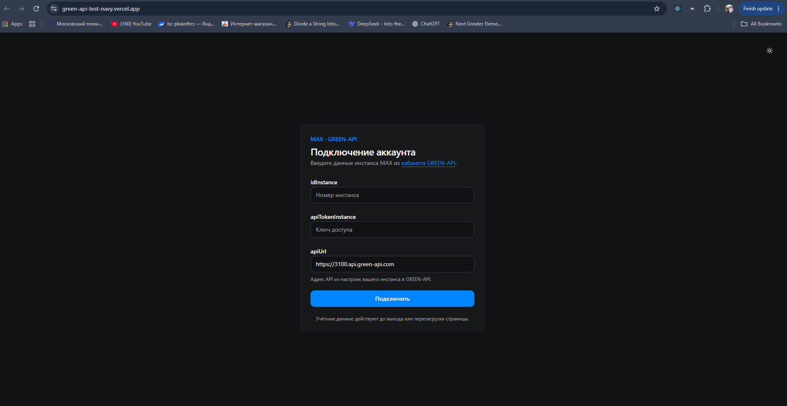
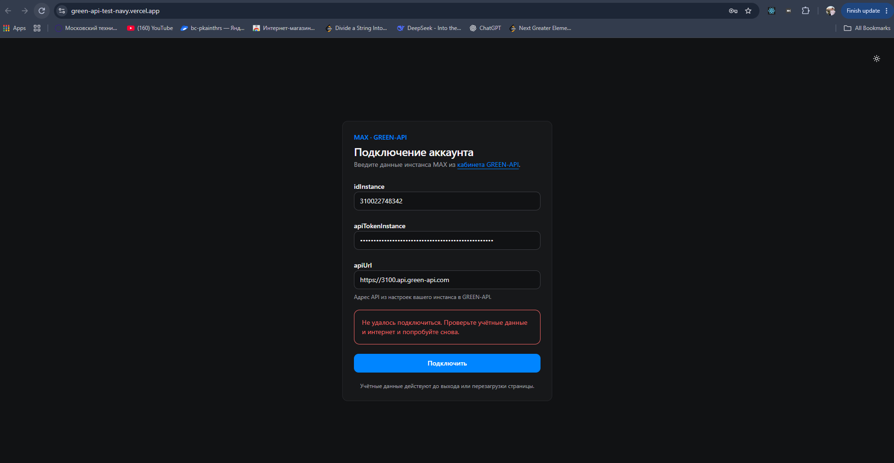
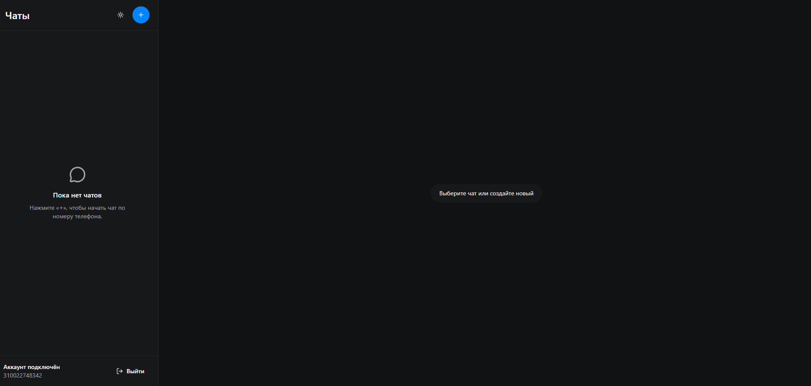
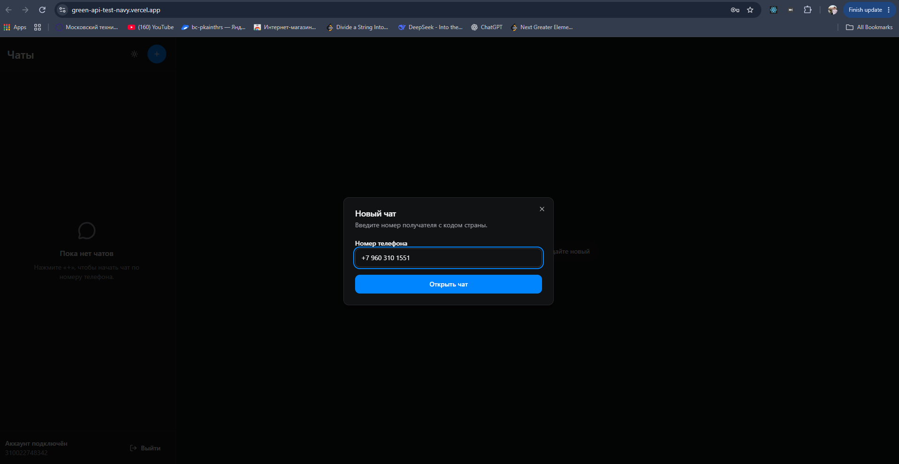
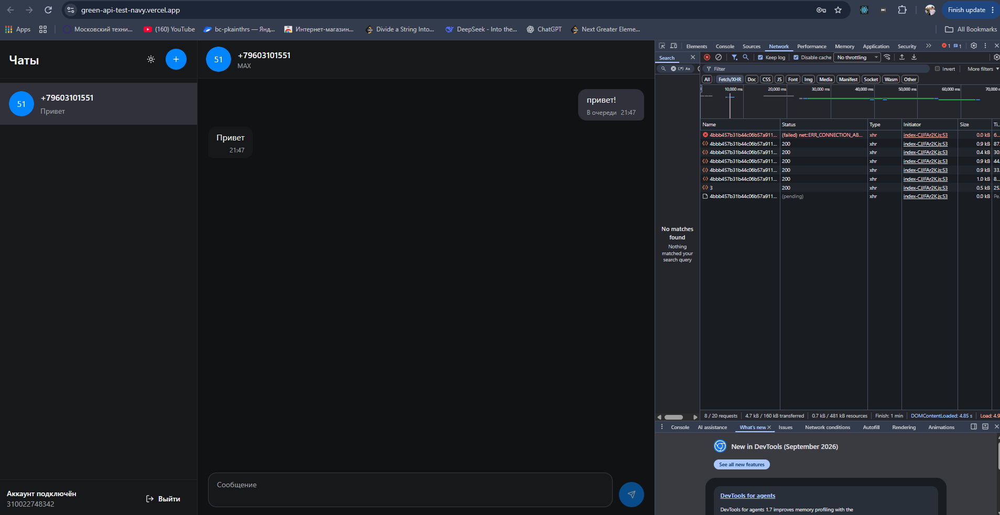

# MAX Chat — GREEN-API

**[Открыть приложение на Vercel](https://green-api-test-navy.vercel.app/)**

Тестовое задание: отправка и получение текстовых сообщений MAX через GREEN-API.
React, TypeScript, Vite, Tailwind CSS, shadcn/ui, Axios, Zustand. Архитектура — FSD.

## Локальный запуск

Нужны Node.js 22.18+ (ветка 22) или 24+ и npm.

```sh
npm ci
```

Скопируйте `.env.example` в `.env` (PowerShell: `Copy-Item .env.example .env`,
Linux/macOS: `cp .env.example .env`).

```dotenv
VITE_API_URL=https://3100.api.green-api.com
```

Укажите адрес API своего инстанса. Переменная задаёт начальное значение поля
`apiUrl`; его также можно изменить в форме. После изменения `.env` перезапустите Vite.
`idInstance` и `apiTokenInstance` вводятся в приложении, в `.env` они не нужны.

```sh
npm run dev
```

Откройте адрес из терминала (обычно http://localhost:5173).

## Подключение MAX

1. Создайте инстанс MAX в [GREEN-API](https://console.green-api.com/), авторизуйте
   свой аккаунт по QR-коду и дождитесь состояния `authorized`.
2. В настройках инстанса включите `incomingWebhook`, оставьте `webhookUrl` пустым,
   сохраните и подождите около минуты.
3. В приложении введите `idInstance`, `apiTokenInstance` и `apiUrl` из кабинета.
4. Нажмите «+», введите номер получателя с кодом страны и откройте чат.
5. Отправьте текст и ответьте из MAX получателя — ответ появится в переписке.

[Подключение инстанса](https://green-api.com/v3/docs/before-start/) ·
[Настройка уведомлений](https://green-api.com/v3/docs/api/receiving/technology-http-api/)

Enter отправляет сообщение, Shift+Enter добавляет перенос. Поддерживается только
текст личных сообщений. История, черновики и учётные данные хранятся в памяти
и очищаются при выходе или перезагрузке. Пометка «В очереди» означает принятие
запроса GREEN-API; статусы доставки не отслеживаются.
Для проверки используйте одну вкладку, читающую очередь инстанса.

## Docker

Нужен запущенный Docker Engine / Docker Desktop с Linux-контейнерами.

```sh
docker build -t green-api-test .
docker run --rm -p 5173:5173 green-api-test
```

Откройте http://localhost:5173. Контейнер запускает Vite через `npm run dev`.
По умолчанию адрес API берётся из `.env.example`. Чтобы использовать свой `.env`:

```sh
docker run --rm --env-file .env -p 5173:5173 green-api-test
```

Локальный `.env` и токены в Docker-образ не копируются.

## Проверки и сборка

```sh
npm run check
npm run build
npm run preview
```

`check` запускает TypeScript, ESLint, Prettier, Jest-тесты хелперов и сборку.
Готовые файлы находятся в `dist`. Неизвестный адрес открывает страницу 404,
ошибка отображения — страницу с кнопкой повторной попытки.

## Возможности приложения

### Подключение аккаунта и доступ к чатам

Вход выполняется по `idInstance`, `apiTokenInstance` и `apiUrl` из GREEN-API.
Форма проверяет обязательные поля, формат идентификатора и адрес API. Токен скрыт
в поле пароля. Перед открытием чатов приложение проверяет состояние инстанса:
переписка доступна только после успешного подключения авторизованного аккаунта.



### Ошибки подключения и форм

При неверных учётных данных или проблемах сети форма показывает сообщение
об ошибке и позволяет повторить попытку. Введённые данные сохраняются.
Во время подключения повторная отправка формы заблокирована.
Ошибки проверки номера и ненайденный аккаунт MAX также отображаются в форме
создания чата. Закрытие диалога отменяет незавершённую проверку номера.



### Список чатов и пустые состояния

После подключения отображаются список чатов, кнопка создания чата, переключатель
темы и выход из аккаунта. Если чатов пока нет, приложение подсказывает, как начать
переписку. До выбора собеседника область сообщений показывает приглашение
выбрать или создать чат.



### Создание чата по номеру

Кнопка «+» открывает форму номера получателя. Пробелы, скобки, дефисы и «+»
убираются перед проверкой; номер должен содержать от 7 до 15 цифр с кодом страны.
Приложение проверяет наличие аккаунта MAX через CheckAccount и использует
полученный `chatId`. Повторный ввод того же номера открывает существующий чат.



### Отправка и получение сообщений

Текст отправляется через SendMessage. Исходящие сообщения отображаются справа,
входящие — слева; у сообщений показано время, в списке чатов — последнее сообщение.
Поддерживаются многострочный текст, эмодзи и текст со ссылками.

Enter отправляет сообщение, Shift+Enter добавляет перенос строки. Пустой или
пробельный текст не отправляется, максимальная длина — 4000 символов.
Во время запроса виден индикатор отправки, повторная отправка заблокирована.
При ошибке текст остаётся в поле для повторной попытки.

Входящие получаются через ReceiveNotification, обработанные уведомления удаляются
через DeleteNotification. Повторное уведомление не создаёт дубль сообщения.
Получение работает независимо от выбранного чата; после сбоя сети опрос
повторяется автоматически через 5 секунд. Сообщения каждого собеседника
остаются в своей переписке при переключении чатов.



### Черновики, темы и адаптивность

- У каждого чата свой черновик: переключение между собеседниками сохраняет текст.
- После успешной отправки черновик очищается; при ошибке остаётся в поле.
- Светлая и тёмная темы переключаются в интерфейсе, выбор сохраняется в браузере.
- На узком экране список чатов и переписка показываются отдельно; стрелка
  в заголовке возвращает к списку.

### Страницы ошибок и хранение данных

- Неизвестный URL открывает страницу 404 с переходом на главную.
- Error Boundary перехватывает ошибки отображения и показывает страницу
  с кнопкой повторной попытки.
- Учётные данные, чаты, сообщения и черновики хранятся в памяти вкладки.
  Выход или перезагрузка очищают их. В localStorage сохраняется только тема.
- При выходе отменяются активные запросы и опрос уведомлений. Выход из приложения
  не отвязывает аккаунт MAX от инстанса GREEN-API.
- История MAX не загружается, файлы и групповые сообщения не отображаются.
  Пометка «В очереди» подтверждает принятие сообщения API, а не его доставку
  или прочтение получателем.
